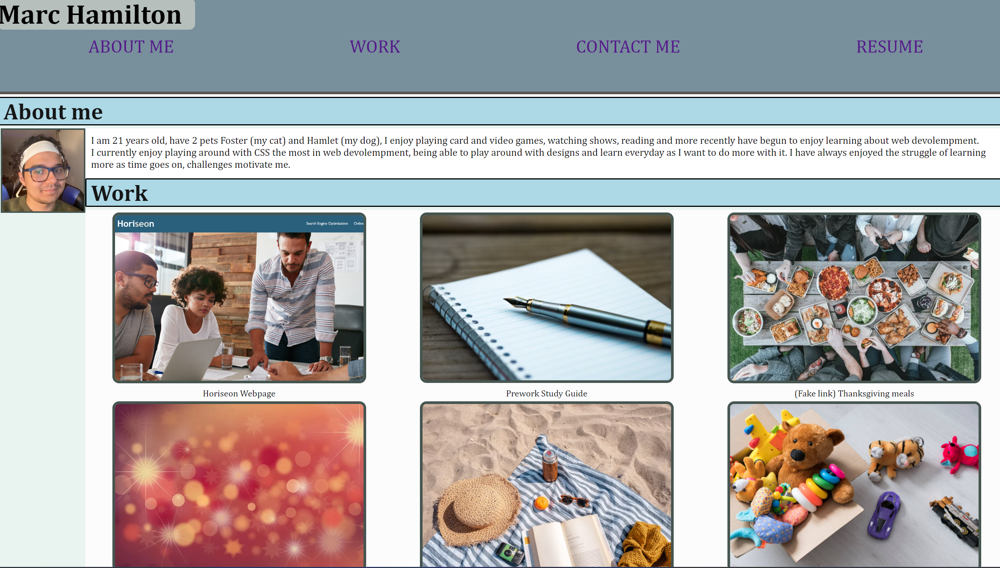

# Marc's Portfolio

# Description
This portfolio is to be used to compile all of my informaiton that is protaining to me and my coding journey, it includes currently a paragragh of me, and the projects I have worked on, past ones, current ones and ones that I am going to make in the future. This will also give anyone who wants a way to contact me a way to do so, either by linkedIn, email, phone number, or github. 

## Requirements
A connection to the internet and a chrome web browser will give you access to this webpage. Just go to #
by typing it into the URL of your web browser and you will be abke to go to this webpage.

## Usage

This website is useful to any employers who would like to see what I have completed and what I am currently working on, along with ways to contact me if you would like to comunicate directly to me. 
Provide instructions and examples for use.

if you would like to go to any of my projects just click on the photo or text under said folder and it will take you to the porject that corasponds with it.

for example if you were to click on the horiseon image it would then take you to the horiseon webpage.

## Credits
Marc Hamilton

## License

Please refer to the license in the github repo.

